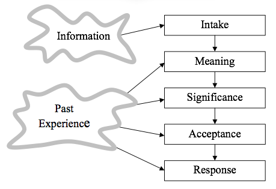

> Originally published in _STQE_
  (now called
  [Better Software Magazine](http://www.stickyminds.com/better-software-magazine))
  Vol. 3 No. 4, July/August 2001.

Do you ever wonder why communication sometimes gets so tangled?
When I think about what it takes to move a thought from one mind to another,
I marvel that communication is possible _at all_.

It is easy to take communication for granted.
We are so used to communicating,
and so used to communicating well,
that most of the time we find it unremarkable.
But sometimes communication gets tangled.
Little misunderstandings lead to big problems
&#8212;
personal stress,
missed schedules,
strained working relationships,
angry customers,
and lots of unexpected work as we scramble to repair the damage.

## How Communication Works
When my communications go wrong,
I get back on track using a model called _The Ingredients of an Interaction_ (see Figure 1).
This model,
developed by family therapist Virginia Satir,
describes what happens inside us as we communicate
&#8212;
the process we go through as we take in information,
interpret it,
and decide how to respond.

&#160;
  
<strong>Figure 1.
The ingredients of an interaction </strong>

Most of the time,
our communication just works.
We zip through this complex process in the blink of an eye,
without thinking about it,
and it comes out right.
But now and then we zip through the process without thinking about it,
and it comes out wrong.
When that happens,
we can use the Satir model to examine our internal process,
find where errors are happening,
and correct them.

Let's explore the model by walking step by step through a simple interaction that worked well:
I was eating lunch at a software conference,
and a man sitting beside me touched my arm and asked,
"Do you have a watch?"
I looked at my watch and said,
"It's 1:15."

### The First Step: Intake
My internal communication process begins with _Intake_.
Through my five senses,
I become aware of the messages that some person is sending to me
through words, gestures, tone of voice, facial expressions,
or other means.

Intake is an active process.
I actively,
if unconsciously,
select which information I will receive.
One way I do this is by directing my senses,
such as when I look at a person who is talking to me instead of at someone else.
Another way is by focusing my attention,
concentrating on only part of the information I am sensing,
such as when I listen to a particular conversation in a crowded room.
Most of the time,
I select information that is relevant to the thoughts,
feelings,
and goals that are occupying me at the moment,
and ignore whatever else is happening.
But other information may attract my attention,
especially if it is unexpected or forceful,
such as a sharp pain,
the cry of a child,
or a bright,
flashing blue light in my rearview mirror.

  > When the man touched my arm,
    I looked at him,
    and focused on his words
    amid all of the conversations and noise in the room.
    "Do you have a watch?"

### The Second Step: Meaning
My next step is to interpret the message.
I give the message a _meaning_,
based partly on information present in the message itself,
and partly on information from my own experience.

Why would I add information? To replace information that the sender left out.
When we send a message,
we rely on the receiver to have certain knowledge in common with us
&#8212;
for example,
the definitions of the words we're using,
or similar experiences with the people,
objects,
actions,
and concepts we are discussing.
If we had to send all of this information in each message,
communication would be unwieldy,
if not impossible.
So we leave out information,
and rely on the listener to fill it in.

So to understand a message,
I fill in the missing information from the source most available to me:
my own experience.
I relate the message to information from experiences that happened at other times,
or in other situations,
or with other people.
If these experiences are sufficiently relevant,
my interpretation will be close to what the sender intended.

  > In the past,
    when people have asked me,
    "Do you have a watch?"
    they usually wanted me to tell them the time,
    and not,
    literally,
    whether I have a watch.
    Applying my experience,
    I then interpreted the man's message to mean,
    "He wants me to tell him the time."

### The Third Step: Significance

Now that I have interpreted the message,
I next assign it a _significance_.
I create a feeling
&#8212;
happy, hurt, angry, afraid, proud,
or any of a thousand emotions
&#8212;
that indicates how the message affects the things I care about.
The strength of the feeling signifies the size of the effect.
The pleasantness or unpleasantness of the feeling signifies whether that effect is good or bad.

In this step,
as in the Meaning step,
I add a lot of information.
The significance I assign comes not just from the message,
but also from the relationship of the message to my goals,
concerns, feelings, values, past experiences,
and information about what is happening around me.
For example,
suppose I am the project manager for a major product,
and the test manager tells me,
"We've just discovered a major defect in the system."
If the project is scheduled to deliver the product in five months,
I may see this as moderately bad news.
On the other hand,
if I have just sent a press release announcing that the product will be released in two days,
the same message will have far greater significance.

  > Here,
    based on the meaning I'd assigned
    ("the man wants me to tell him the time"),
    the corresponding feeling I created was a mild,
    pleasant desire to help.

### The Fourth Step: Acceptance

Next comes the _Acceptance_ step.
I decide,
usually unconsciously,
whether it is okay for me to feel what I am feeling.
The question is not about whether the feeling is pleasant,
but whether I will allow myself to feel it.

I may believe that some feelings and thoughts are not okay.
If in the past I was punished or judged for expressing fear or anger,
or even joy,
I may have learned that I "should not" express these feelings,
or even feel them.
Or I may have learned that certain feelings are okay in some situations,
but not in others.
For example,
it may be okay to feel anger at home,
but not in a software project meeting.

  > In this case,
    it was okay for me to feel the mild,
    pleasant desire to help the watchless man.

### The Fifth Step: Response

Based on the message I've received,
the meaning I've made,
the significance I've assigned,
and my acceptance of my feelings,
I start thinking of possible _responses_.
I don't indiscriminately blurt out whatever comes into my head.
I filter the responses and reject the ones that seem ineffective or inappropriate.

One filter is based on my decision about whether it is okay to feel what I am feeling.
If it is okay,
I can respond in a way that is congruent with what I truly think and feel.
If not,
I may try to hide my true thoughts and feelings.

Another filter is my _rules for commenting_.
In my past,
I may have learned rules such as "don't talk to strangers,"
or "never contradict the Director of QA in public,"
or "always respect your elders."
If one of my rules applies to the response I'm considering,
I may reject the response and think up another.

Eventually,
I select one of the responses that pass through my filters,
and I express my response
through words,
gestures,
tone of voice,
facial expressions,
or other means.
At that point,
the other person's internal process begins,
as in our "what time is it" example:

  > In this case,
    none of my rules for commenting applied.
    I looked at my watch and said,
    "It's 1:15."

The simple interaction took less than three seconds,
and took place---as most interactions do--- without my having even been aware of my internal process.

## Untangling Interactions

Of course not all our information exchanges are as simple as asking the time of day;
most day-to-day communications hold the potential for multiple snarls and tangles.
When my communication gets tangled,
I use the Ingredients of an Interaction model to slow down,
examine my internal communication process,
and discover where I may be making mistakes.

I focus first on my own process,
because the errors I can most easily correct are the ones that _I_ make.
When I see and hear clearly,
interpret accurately,
assign the right significance,
and accept my feelings,
I understand other people's messages better,
and my responses are more effective and appropriate.
And when I understand well,
I am better able to notice when other people misinterpret my messages,
and to correct the misunderstanding.

### Errors in Intake
Each step depends on earlier steps.
If we get the earlier steps wrong,
we are likely to compound the error in later steps,
and respond in a way that bewilders the people we are talking to.
When communication gets tangled,
the Intake step is a good place to start looking for errors.

Here's an example of how Intake can go wrong.
Jennifer,
a tester,
has spent three days testing the new customer contact database.
She finished the testing,
and sent her test report to Robert,
the test manager.
The next day,
Robert called Jennifer,
furious.
"You wasted three days testing the _contact_ database?
We tested that already!
I told you to test the _contract_ database!"

When your communications get tangled,
first make sure you are getting the Intake right.
Ask yourself,
"What did I see and hear?"
Then validate your answer with the other person.
"Did you say to test the _contact_ database or the _contract_ database?"

When others respond to you in a puzzling way,
it may help to check their Intake.
You might say,
"I'm not sure what you heard me say,"
and ask them to paraphrase it back to you.

Intake errors can be difficult to notice as they happen.
Often,
as in Jennifer's case,
we don't notice the errors until later,
after we have responded.
It's probably not a good idea to try to validate everything that everyone says to you.
But when you first notice a conversation going wrong
&#8212;
especially an important conversation
&#8212;
check your Intake.

### Errors in Meaning

When we talk we omit important information,
and we rely on our listeners to fill in this information from their own experience.
Most of the time,
this works well enough to convey the meaning we intend.
But sometimes,
the information that listeners fill in differs from the information we left out,
and people interpret our messages in ways we did not intend.

For example,
Mark,
the product manager for a software system,
and Sam,
the test manager,
are discussing the ship date for the next release.
Mark says,
"We may have to ship before we finish testing."

Sam hits the roof.
"No way,
no how,
are we going to skip testing and ship blindly to our customers! You've _gotta_ be
&#8212;"

Mark interrupts.
"Look,
Sam,
we have business realities to deal with here.
Let's be pragmatic."

Sam and Mark continue to argue,
positions hardening,
voices carrying through the closed door and down the hall.
Suddenly,
Sam stops in mid-shout.
Slowly,
he says,
"Mark,
I wonder if we're both defining 'testing' the same way."

They quickly learn that their definitions differ in important ways.
When Sam says testing,
he means "evaluating the system."
Mark,
on the other hand,
means "product improvement."
Once they define their words,
Mark and Sam find that they are in complete agreement about the schedule.

When communications get tangled,
a helpful principle for untangling them is Jerry Weinberg's Rule of Three Interpretations: _If I can't think of at least three different interpretations of what I received,
I haven't thought enough about what it might mean._ Before responding to any one meaning,
think of at least two other possible meanings.

Also helpful is Miller's Law,
which says,
"To understand what another person is saying,
you have to assume that it is true and try to imagine what it might be true of."
To apply Miller's Law,
ask yourself,
"If what the person said were true,
what else would have to be true? Under what circumstances would it be true? In order for me to believe that,
what else would I have to believe?"
The answers you get are _presuppositions_
&#8212;
the unstated,
but implied,
meanings in the message.
Identifying the presuppositions helps you to fill in the information that the sender left out of the message.

Miller's Law and the Rule of Three Interpretations guide you to identify _possible_ meanings.
Once you have identified a number of possible meanings,
test them.
The simplest way is to tell the sender what meaning you made,
and ask whether you got it right: "Do you mean that don't want us to evaluate the system?"

### Errors in Significance
Clarifying the meaning of the message may untangle your communication.
Sometimes that's not enough,
so the next step is to check the significance.

We assign significance based partly on the meaning we've made,
and partly on our own experience.
When the experience is relevant,
the significance we assign to the message is likely to fit,
and help us to come up with a response that is appropriate to the message and the situation.

Sometimes our experience is less relevant to the current message.
In these cases,
the feeling we create may fit less well in the present situation.
I was once in a meeting with Larry,
the product manager for whom I had worked for several years,
and six engineers.
We were trying to decide whether to make our proprietary thread package available to customers through our public API,
as a key potential customer had requested.
Larry thought that making the threading functions available was a good idea.
I was adamantly against it.

Larry and I were unable to reach consensus.
The meeting ended with everyone feeling frustrated and spent.
Tom,
one of the engineers at the meeting,
visited me in my office,
and said,
"Wow,
you sure were angry in that meeting!"

"No,
I wasn't angry,"
I said.
"I just think it would be a mistake to expose such a low-level interface."

"Well,"
he said,
"You sure sounded angry to me."

As I drove home that night,
I slowly began to realize that Tom had been right.
Though I had been unaware of it during the meeting,
I had been not just angry,
but furious.
Later,
as I tossed and turned trying to sleep,
I realized that the topic of the meeting,
the decision about exposing the thread package,
had played only a small role in my anger.
What I had been really furious about were the many "similar" situations over the previous few years in which Larry had made design decisions over my strong objections.
Though I had not been consciously aware of it,
I had come to resent these decisions.
My resentment had contaminated this meeting and a number of others.

The next morning,
I met with Larry to talk about what I had learned.
We still disagreed about the API,
but we were able to express our disagreement much more calmly and to understand each other's point of view much more compassionately.

I had given this conversation much greater significance than it warranted.
For me,
the conversation was not just a single decision about an API,
but a symbol of all of the unresolved issues in my relationship with Larry.

When your communications get tangled,
check your feelings,
and consider the possibility that your reaction may be about what happened at some other time and place,
perhaps with some other people.
Ask yourself these questions: What am I feeling here? Does the intensity of my feeling seem appropriate,
given what is happening here and now? Is some part of my feeling coming from some other time and place,
or from experiences with other people?

Your answers may help you to separate what is happening here and now from what happened there and then.
Or they may help you to see more clearly how your past experience gives you insight about what is happening in the current conversation.
Either way,
you will often learn something that will give you an idea about how to get your communications back on track.

### Errors in Acceptance
The idea that some feeling is not okay _always_ comes from the past.
If I can't accept what I am feeling,
that is a sure sign that I've got the current conversation tangled up with the past,
with the people and events from which I learned that the feeling was not okay.
I don't always have to say everything I'm feeling,
but if I can't even accept that I'm feeling it,
I will remain stuck in the past,
unable to untangle the conversation here and now.

In my experience,
the most powerful thing I can do to keep my communications straight,
and to untangle them when they get tangled,
is to accept what I feel.

I have learned that I can accept any feeling if only I can become fully aware that I am feeling it.
This poses a dilemma,
because when my feelings are unacceptable to me,
it doesn't help much to ask,
"What am I feeling?"
In those cases,
I find it remarkably easy to fool myself.
For example,
even when Tom suggested that I had been angry,
I was not aware of my anger.
And I was certainly not aware that beneath the anger lay resentment.

One way I stop fooling myself is to notice when someone says something like,
"Wow,
you sure were angry!"
People can't always tell what I am feeling,
but they often have information about me that I don't have
&#8212;
the stress in my voice,
the rigidity of my posture,
the redness of my face.
This information can trigger me to check out my feelings.

To get below the surface and discover my deeper feelings,
I use the Sentence Completion Technique.
On the top of a sheet of paper,
I write,
"One of the things I'm feeling here is &#8212;"
Then,
as quickly as possible,
without stopping to think,
I write ten or more endings for the sentence,
such as,
"&#8212; frustration.
&#8212; anger.
&#8212; resentment."
My first few answers often fall into the "fooling myself" category,
but by the time I have ten endings,
I've usually found the heart of what I really feel.
If I can accept what I am feeling,
I can deal with it appropriately.

### Errors in Response
Rules for commenting are rooted in the past.
As in the Meaning,
Significance,
and Acceptance steps,
we can make errors if we apply the past inappropriately in our present conversations.
I once worked for a manager who frequently shouted,
"Don't bring me problems! Bring me solutions!"
I quickly turned that into a rule for commenting.
I don't know whether following the rule was a mistake in that situation.
It _would_ be a mistake to apply the rule with my current manager,
who not only seems to appreciate early warnings about problems,
but also often has an immediate solution to offer.

I'm not suggesting that you eliminate your rules for commenting.
I'm suggesting that you become aware of them,
so you can choose consciously whether to apply them in your present conversations.

To discover your rules for commenting,
use the Left Hand Column technique,
developed by Chris Argyris.
Think of a recent tangled conversation.
Draw a line down the middle of a sheet of paper.
On the right side,
write out the conversation as accurately as you can remember it.
On the left side,
write what you were thinking and feeling at the time,
but did not say.
Now examine the left hand column,
and ask,
"What were my reasons for not saying that?"
As you work through a number of conversations,
you may notice patterns emerging in your reasons for not speaking up,
such as
"That might hurt his feelings"
or "I'm the only one who has a problem with this proposal."
These recurring reasons offer clues about your rules for commenting.

## Untangling Conversations
Communication typically takes place in the context of a conversation.
The history of a conversation,
the messages that have been sent and received so far,
affect how we respond to the next message.
For example,
if the man at the conference had first said,
"I'm a watch salesman,"
I would have made a very different meaning when he asked,
"Do you have a watch?"

One source of errors in is invisible intentions.
We often jump right into a conversation without telling the other person what we want from the conversation.
We interpret each other's messages in the context of our own intentions,
and what we _believe_ the other person's intentions to be,
fantasizing all the while that we're talking about the same thing.
If we're mistaken,
our interpretations will be inaccurate,
and our responses confusing.
Eventually,
we may realize that we are having not one conversation,
but two.

Here's an example in which I failed to notice the other person's intentions,
though he stated them clearly several times.
I lead a council of representatives from IT groups who meet weekly to share and recommend ideas for improving our processes.
Peter,
who has missed several meetings recently,
missed the first half of our latest meeting.
Later that day,
Peter called me.
"I want to make sure we're okay in our working relationship."

I said,
"Okay.
I have a problem,
Peter.
Part of my job to make sure every group is represented well on the council.
When you miss the meetings,
your group's ideas and concerns are not represented."

Peter told me that he had missed the meeting because of a doctor's appointment,
and that a number of other concerns kept him from finding someone else to attend to represent his group.
He ended with,
"So are we okay?"

I said,
"Yes,
the doctor's appointment was important.
I expect that other important things will come up in the future.
How can we make sure your group is represented when that happens?"

Peter again told me about the doctor's appointment,
and what the diagnosis had been.
He went on to list the reasons he'd been unable to attend the recent meetings.
Again,
he finished by saying,
"So are we okay?"

We went back and forth a few more rounds.
I noticed that Peter and I were repeating ourselves,
a clue that perhaps we were having two separate conversations.
Peter wanted to know that our relationship was okay,
and I wanted to fix a problem to make the relationship okay.

I said,
"I'm glad you saw the doctor.
That was clearly the most important thing for you to do.
I want you to take care of yourself,
even if it means missing the meeting."
This time,
instead of continuing on with my concern,
I stopped.

Peter said,
"Thank you for saying that.
I appreciate that you can see how important this was to me."

With that,
Peter had what he needed from the conversation.
We were then able to talk about my concern,
and work out an agreeable solution.

If you suspect that you are having two separate conversations,
stop and identify what each conversation is about.
Then go ahead and have the two conversations,
but have them one after another instead of at the same time.

## Putting the Tools into Practice
It can be difficult to notice communication errors as they happen
&#8212;
especially in the middle of a stressful conversation,
where errors can cause the most harm.
And some kinds of errors may be harder to spot than others.
I can often recognize errors in interpretation,
but have a harder time noticing when my feelings are tangled,
especially when I might have difficulty accepting those feelings.

Fortunately,
it's okay to be imperfect.
If a conversation in a project meeting gets tangled,
you don't always have to know what the error is or how to fix it.
If you can simply notice that the conversation is tangled,
you may be able to take a break,
or stop the conversation if necessary.
And if you notice the tangle only after the conversation,
that may be okay,
too.
Once you notice it,
you can try some of the techniques to explore your internal communication process,
and perhaps reconnect with the person to repair any damage.

Many of the techniques I've described are easy to practice.
Gather a few colleagues and walk through some simple interactions,
and then some more complicated ones.
Use the techniques to analyze some recent puzzling conversations,
perhaps with the other people involved.
Practice as you review your next requirements specification.

By applying the same level of awareness and problem-solving skills that you use in catching problems in software,
you will begin to notice the signs of trouble in communication just a little bit earlier.
In many cases,
that will be enough to trigger you to slow down,
walk through the communication process,
and get your communication back on the right track.

